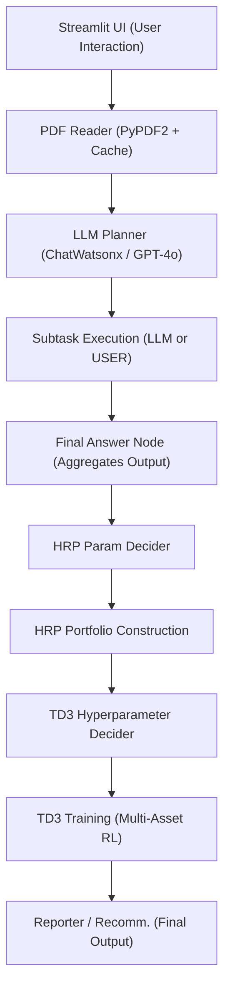

# Agentic Hedge Fund Chatbot

Welcome to the **Agentic Hedge Fund Chatbot** repository! This project brings together multiple components—language models, PDF parsing, Hierarchical Risk Parity (HRP), and a TD3 reinforcement-learning agent—to demonstrate an end-to-end workflow for answering investment-related questions, constructing a risk-weighted portfolio, and training a trading agent, all via a Streamlit app.

---

## Table of Contents

1. [Overview](#overview)  
2. [Features](#features)  
3. [Architecture](#architecture)  
4. [Installation and Setup](#installation-and-setup)  
5. [Usage Instructions](#usage-instructions)  
6. [Key Components](#key-components)  
   - [Disabling File Watchers](#disabling-file-watchers)  
   - [Streamlit App Structure](#streamlit-app-structure)  
   - [LLM Setup](#llm-setup)  
   - [PDF Reading](#pdf-reading)  
   - [Planner and Execution Nodes](#planner-and-execution-nodes)  
   - [Hierarchical Risk Parity (HRP)](#hierarchical-risk-parity-hrp)  
   - [TD3 Reinforcement Learning](#td3-reinforcement-learning)  
   - [Reporter / Recommender](#reporter--recommender)  
7. [Extending the Project](#extending-the-project)  
8. [Contributing](#contributing)  
9. [License](#license)

---

## Overview

This repository contains a **Streamlit-based chatbot** that:

1. **Reads and processes a PDF** (e.g., an investment statement).  
2. **Generates subtasks** with an LLM planner to determine missing information.  
3. **Interacts with the user** whenever *USER* subtasks require input.  
4. **Executes LLM-only subtasks** automatically.  
5. **Aggregates** all answers into a **final response**.  
6. **Decides HRP parameters** to build a risk-parity portfolio.  
7. **Trains a TD3 trading agent** in a toy multi-asset environment.  
8. **Reports final recommendations** via a reporter agent.

---

## Features

- **User-PDF Interaction** – ask questions about your uploaded PDF.  
- **Automated Planner** – breaks questions into *LLM* and *USER* subtasks.  
- **Hierarchical Risk Parity** – constructs a risk-balanced portfolio.  
- **TD3 Trading Agent** – simulates trading on selected assets.  
- **Reporter Agent** – delivers a JSON recommendation summarising results.

---

## Architecture


⸻

## Installation and Setup
1.	**Clone the repository:**
```bash
git clone https://github.com/your-username/agentic-hedge-fund-chatbot.git
cd agentic-hedge-fund-chatbot
 ```

2.	**Create a virtual environment (optional but recommended):**
```bash
python -m venv venv
source venv/bin/activate  # On Windows: venv\Scripts\activate
 ```
3.	 **Install dependencies:**
```bash
pip install -r requirements.txt
 ```
Make sure you also install PyTorch for your system configuration, as well as any additional libraries not covered in the requirements.txt.

4. **Set environment variables (if using Watsonx or OpenAI keys):**
```bash
export WATSONX_URL=<your_watsonx_url>
export WATSONX_APIKEY=<your_watsonx_api_key>
export WATSONX_PROJECT_ID=<your_watsonx_project_id>
export OPENAI_API_KEY=<your_openai_api_key>
```
Alternatively, store these in a .env file in the same directory.

5. **Run Streamlit:**
```bash
streamlit run /path/Agentic_AI_Hedgefund_Chatbot.py.py
```
Replace Agentic_AI_Hedgefund_Chatbot.py with the actual script name if you changed it.

If you get a "No module named yfinance" error, please try:
```bash
"/Library/Frameworks/Python.framework/Versions/3.11/bin/python3" -m pip install yfinance --upgrade
```
⸻

## Usage Instructions
```bash
	1.	Open the Streamlit app in your browser (usually http://localhost:8501).
	2.	Upload a PDF file that you want to query (for example, an official investment policy document).
	3.	Enter your question about the PDF’s contents and click Run Chatbot.
	4.	The app will:
	      - Parse the PDF.
	      - Use the LLM-based planner to create subtasks.
	      - If some subtasks are labeled USER, it will prompt you to answer questions the LLM cannot infer from the PDF.
	      - If subtasks are labeled LLM, the system will automatically handle them.
	      - Finally, it will produce a final answer to your question.
	5.	Further Steps:
	      - Decide HRP Parameters using the chatbot’s final answer.
	      - Run Hierarchical Risk Parity to see the constructed portfolio weights.
	      -	Decide hyperparameters for the TD3 agent.  
              - Train the TD3 Agent on sample financial data.
	      - Run the Reporter to produce a JSON recommendation with the final outcome.
```
⸻

## Key Components

**Disabling File Watchers**
```bash
os.environ["STREAMLIT_SERVER_FILE_WATCHER_TYPE"] = "none"
```
Prevents file-watch overhead on Python 3.12 + Torch within Streamlit.

**Streamlit App Structure**
```bash
The main() function in the code orchestrates:
  - File upload and question input.
  - Subtask-based approach to either prompt the user (USER) or use an LLM (LLM).
  - Final answer generation.
  - HRP parameter picking, portfolio construction, and TD3 agent training.
  - Reporter that generates a recommendation JSON.
```
**LLM Setup**
```bash
from langchain_ibm import ChatWatsonx
from langchain_openai import ChatOpenAI

	- Uses langchain-style wrappers for IBM Watsonx and GPT-4o.
	- Adjustable prompts in the code for custom logic.
```
**PDF Reading**
```bash
@st.cache_data
def read_pdf_text(file_path: str) -> str:
    ...

	- Uses PyPDF2 to extract text and caches the result for performance.
```

**Planner and Execution Nodes**
```bash
	- Planner: Generates a JSON structure of subtasks (some to be answered by the LLM, others by the user).
	- Executor: For each subtask, it either handles LLM calls or asks the user for missing data.
```
**Hierarchical Risk Parity (HRP)**
```bash
def run_hrp_inline(chatbot_answer: str, hrp_params: dict) -> str:
    ...

	- Fetches price data from Yahoo Finance.
	- Computes a robust covariance using LedoitWolf, then runs hierarchical clustering to get final portfolio weights.
```
**TD3 Reinforcement Learning**
```bash
def run_td3_agent_thread(out_queue, hyper_json):
    ...

	- A background thread that trains a TD3 agent in an AdvancedMultiAssetTradingEnv.
	- Streams output to the UI line by line so users can see training progress.
```
**Reporter / Recommender**
```bash
def reporter_agent(user_question: str, chatbot_output: str, td3_output: str, hrp_output: str) -> str:
    ...

	- Produces a final JSON with:
	- "Decision": either "Complete" or "Rerun".
	- "Explanation": short text summarizing the logic.
```
⸻

## Extending the Project
```bash
	- Support More Assets or different data sources in HRP.
	- Enhanced RL Environments with more reward shaping or more assets.
	- Fine-Tune LLM Prompts to better handle domain-specific queries.
	- Plug in Different LLM Models easily, via langchain integration.
```
⸻

## Contributing
```bash
Contributions are welcome! Feel free to open issues, add pull requests, or fork this repository to make improvements.
Ensure any modifications maintain clarity, modular structure, and consistent code formatting.
```
⸻

## License
```bash
This project is licensed under the MIT License.
Feel free to modify and use it for personal or commercial purposes, provided that this license is retained.
```
⸻

**Thank you for exploring the Agentic Hedge Fund Chatbot!
I hope this workflow inspires new ideas for combining language models, portfolio construction, and reinforcement learning. If you have questions or need help, please reach out via GitHub issues.**
